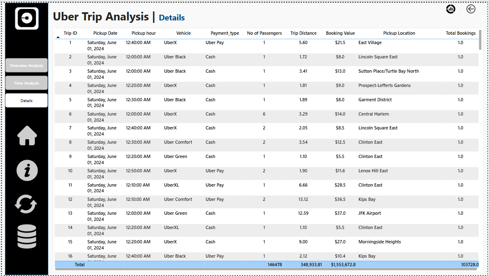

# Uber-Analysis
Uber Trip Analysis Project Analyze Uber trip data using Power BI to gain insights into booking trends, revenue, and trip efficiency. The project includes dynamic dashboards for overview, time-based analysis, and detailed insights, helping stakeholders make data-driven decisions to optimize operations and improve customer satisfaction.

## Dashboard 1: Overview Analysis

## KPIs
- **Total Bookings**: Number of trips booked over a given period.
- **Total Booking Value**: Total revenue generated from all bookings.
- **Average Booking Value**: Average revenue per booking.
- **Total Trip Distance**: Total distance covered by all trips.
- **Average Trip Distance**: Average distance traveled per trip.
- **Average Trip Time**: Average duration of trips.

## Expected Outcomes
* Identify trends in ride bookings and revenue generation.
* Analyze trip efficiency in terms of distance and duration.
* Compare booking values and trip patterns across different time periods.
* Provide insights to optimize pricing models and improve customer satisfaction.

## Features
## Measure Selector
Create a disconnected table with values (Total Bookings, Total Booking Value, Total Trip Distance) to dynamically update visualizations based on user selection.

* By Payment Type: Card, Cash, Wallet, etc.
* By Trip Type: Day/Night
  
## Additional Enhancements
- **Dynamic Title**: Update chart titles based on the selected measure.
- **Slicers**: Add filters for Date, City, and other interactive filters for deeper analysis.
- **Tooltips**: Show additional details like Average Booking Value or Trip Distance.

## Vehicle Type Analysis
Create a grid table (matrix or table visual) to analyze key performance indicators across different vehicle types.

- **Table or Matrix Visual**: Display Vehicle Type with KPIs.
- **Conditional Formatting**: Highlight high and low values.
- **Sorting & Filtering**: Enable user interaction.

## Total Bookings by Day
* Detect trends and fluctuations in daily trip volumes.
* Identify peak and off-peak booking days.
* Understand the impact of external factors on ride demand.
* Support strategic planning for resource allocation and pricing adjustments.

## Location Analysis
- **Most Frequent Pickup Point**: Identify common starting locations for trips.
- **Most Frequent Drop-off Point**: Find common drop-off locations.
- **Farthest Trip**: Determine the longest trip based on distance traveled.
- **Total Bookings by Location (Top 5)**: Identify top 5 locations with the highest trip bookings.
- **Most Preferred Vehicle for Location Pickup**: Determine the most frequently booked vehicle type at each pickup location.

## Other Implementation Enhancements
- **Bookmark for Data Details**: Display a pop-up or side panel explaining key metrics, tables used, data source, and refresh frequency.
- **Clear Slicer Button**: Reset all selections in one click for improved user experience.
- **Download Raw Data Button**: Export raw data in CSV or Excel format using Power Automate or built-in Power BI Export functionality.
  
## Dashboard 2: Time Analysis

## Features
- **Global Dynamic Measure**: Create a measure selector for Total Bookings, Total Booking Value, and Total Trip Distance to update all visuals based on user selection.

## Visualizations
- **By Pickup Time (10-Minute Intervals)**: Area chart grouping trip bookings into 10-minute intervals throughout the day.
- **By Day Name**: Line chart showing booking trends across Monday to Sunday.
- **By Hour and Time**: Heatmap (matrix grid) highlighting peak booking hours across different days.

## Dashboard 3: Details Tab

## Features
- **Grid Table with Key Fields**: Displays essential trip details.
- **Drill-Through Functionality**: Allows users to drill through to detailed records related to selected data points.
- **Bookmark for Full Data View**: Toggle between filtered drill-through data and the complete dataset.

## Implementation
- **Data Preparation**: Clean and preprocess Uber trip data.
- **Dashboard Creation**: Design and develop interactive Power BI dashboards.
- **Deployment**: Deploy dashboards for stakeholder use with comprehensive documentation.

